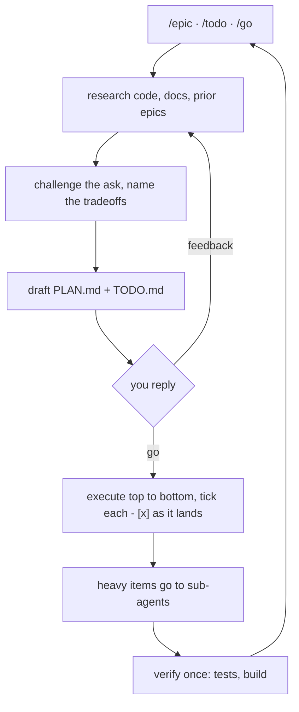

# ⚡ awesome-agent

> Plan-first agentic coding you can supervise: **research → plan → `go` → execute → track**, written to `PLAN.md` + `TODO.md` in your repo.

[](https://github.com/assawalhy/awesome-agent/actions/workflows/ci.yml)

Agentic coding commits to a direction before you can see it, then loses the
thread. awesome-agent fixes the loop: one agent plans and executes, a hard gate
holds it until you reply `go`, and every decision lands in markdown you can
review in the PR.

## 🚀 Install

The installer detects your harnesses (OpenCode, Claude Code, Cursor, Kiro,
Codex, Pi, Kilo, Kimi, DeepSeek) and installs into the ones you pick.

```bash
git clone https://github.com/assawalhy/awesome-agent.git
cd awesome-agent
./install.sh
```

Restart your harness, then start with `/epic`, `/todo` or `/go`. Non-interactive:

```bash
./install.sh --all                   # every detected harness, global scope
./install.sh --target claude:local   # this project only, travels with the repo
./install.sh update                  # re-copy files + prune removed ones
./install.sh --help                  # every target and flag
```

## 🔁 The loop



## 📦 What you get

| Piece | Invoke | What it does |
| --- | --- | --- |
| `/epic` | `/epic <goal>` | Interview, research, plan and build a feature |
| `/todo` | `/todo <task>` | Add a task to the epic it belongs to |
| `/go` | `/go` | Execute the active plan autonomously |
| `awesome-agent` | delegate to it | The plan-first agent itself |
| `awesome-worker` | used for you | Cheap-model sub-agent for mechanical work |
| `awesome-plan` | auto-loaded | The workflow skill every command and agent follows |
| `pr-description` | auto-loaded | Writes the PR body from the branch diff |
| `ddd` | auto-loaded | DDD + Clean Architecture that conforms to your repo |

Plans live in `.agents/plans/<NN>-<slug>/` and commit with the code.

## 🧠 Good to know

- 🔄 Come back later and tell the agent to continue: it reads the active plan and `TODO.md`.
- 📐 Scope: the default is global (`~/.claude`, `~/.config/opencode`, ...); `--scope local` or `claude:local` keeps everything in the project.
- ⚠️ Run your harness in auto mode, not plan mode. The skill owns the gate. OpenCode and Kiro installs set the default agent for you.
- 🧩 Codex and Pi have no file-based agents; their commands run as prompt templates.

## 📄 License

MIT. See [LICENSE](LICENSE).
