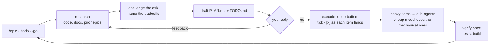

# awesome-agent

> Plan-first agentic coding you can actually supervise:
> **research → plan → `go` → execute → track**, written to `PLAN.md` + `TODO.md` in your repo.

[](https://github.com/assawalhy/awesome-agent/actions/workflows/ci.yml)

Agentic coding fails in a predictable way: it commits to a direction before you can see
it, then loses the thread. `awesome-agent` fixes the loop itself. **One agent plans *and*
executes.** A hard gate holds it until you reply `go`. Every decision, tradeoff and
open checkbox lands in a plain Markdown file you can read, diff and review in the PR.

- **One gate instead of a mode switch.** No "switch from the plan agent to the build
  agent" — the same agent plans and executes, so the reasoning survives the switch.
- **Progress you can see.** `- [x]` is written the moment an item passes a minimal check,
  not batched at the end of a run.
- **A record, not a transcript.** Goals, decisions and rejected alternatives are committed
  markdown — reviewable long after the session is gone.
- **Every harness, one install.** Four slash commands, two agents and three skills land in
  whichever coding harness you already use, globally or inside a single project.

## The failure modes

| What goes wrong | What this does about it |
| --- | --- |
| You come back after an hour and can't tell which agent is doing what | One folder per goal — `.agents/plans/<NN>-<slug>/` with a `PLAN.md` and a `TODO.md` — so every piece of work has an address you can look up |
| Progress lives in a transcript that scrolled away | `- [x]` is written the instant an item lands, so the checklist is the progress bar, not a memory test |
| Picking work back up means re-explaining everything | `/continue` reads the plan, the checklist and the state of every sub-agent and picks up from there |
| A second agent can't be handed the work | The plan is on disk, not in someone's head — any session, any harness, any model resumes from the same files |
| "Why did we do it this way?" is answered by vibes | `PLAN.md` keeps Goal, Approach, **Decisions with the alternative that lost**, Milestones and Risks — committed with the code |
| The agent sometimes skips straight to writing code | A hard gate: no non-trivial execution before you reply `go` |
| Switching a harness's plan agent to its build agent is a fight, and the context dies | One agent, one context. The skill owns the gate; the harness runs wide open |
| The plan itself is a puzzle to read | Approval summaries are visual: a file tree for scope, a flow for the approach, one line per decision |
| Five parallel agents run five heavy builds and your laptop freezes | Work is tiered by reasoning weight: mechanical items go to a cheap model in a sub-agent, and tests/build run **once**, at the end |

## Install

```bash
git clone https://github.com/assawalhy/awesome-agent.git
cd awesome-agent
./install.sh                 # detects your harnesses, pick targets, then pick scope
```

Restart your harness so it picks up the new files. Then, in any session:

```
/epic  add a rate limiter to the login route
```

Non-interactive:

```bash
./install.sh --all                          # every detected harness, global scope
./install.sh --target opencode,claude       # specific harnesses
./install.sh --target claude:local          # this project only, travels with the repo
./install.sh --target local                 # mimic the harness used in this folder
./install.sh update                         # re-copy current files + prune removed ones
./install.sh uninstall                      # remove, including files dropped in later versions
```

Installing into **OpenCode** also sets `default_agent: awesome-agent` in
`~/.config/opencode/opencode.json`, so every new session starts plan-first instead of
opencode's built-in `build`. Uninstall restores your previous default. Installing into
**Kiro** does the same with `chat.defaultAgent`.

## The loop



What that looks like, condensed:

```
$ /epic add a rate limiter to the /login route

  Goal         5 req/min per IP on /login → 429 + Retry-After
  Approach     token bucket in Redis (already a dep for the session store)
  Decisions    Redis over in-process — 3 instances sit behind the LB
               rejected: in-process (resets on every deploy),
                         nginx limit_req (can't set Retry-After per client)
  Milestones   bucket → middleware → config → tests
  Risks        cache outage: fail open and log, or fail closed?

  .agents/plans/04-rate-limit-login/
  ├── PLAN.md
  └── TODO.md
      - [ ] RedisBucket behind a RateLimiter interface
      - [ ] middleware sets 429 + Retry-After
      - [ ] config flag with defaults
      - [ ] tests: allow, 429, refill

  Reply `go` to execute, or give feedback to refine.

$ go

  - [x] RedisBucket behind a RateLimiter interface
  - [ ] middleware sets 429 + Retry-After
      ...the checklist moves while it works, then the full suite runs once at the end
```

## What you get

| Piece | Invoke | What it does |
| --- | --- | --- |
| `/epic` | `/epic <goal>` | Plan a big feature, then build it — interview, research, plan, gate |
| `/todo` | `/todo <task>` | Drop a task into the epic it belongs to (asks if none fits), start it after the current work |
| `/continue` | `/continue` | Resume unfinished work; report every sub-agent and background job |
| `/go` | `/go` | Execute the active plan autonomously; asks for a plan if there is none |
| `awesome-agent` | delegate to it | The plan-first agent itself — hand it a goal, it runs the whole workflow |
| `awesome-worker` | used for you | Cheap-model sub-agent for mechanical specs; reports a terse verified result |
| `awesome-plan` | auto-loaded | The workflow skill every command and the agent follow — one source of truth |
| `pr-description` | auto-loaded | Writes the PR description for the current branch, product or technical |
| `ddd` | auto-loaded | DDD + Clean Architecture layering that detects your repo's actual topology and conforms to it |

Plans and checklists live under `.agents/plans/<NN>-<slug>/`, so they commit with the
repo and slot into the `~/.agents/AGENTS.md` convention you may already use.

## How it works

- **Nothing lives in your head.** The plan and the checklist are files in the repo. Close
  the tab, come back tomorrow, type `/continue`.
- **One gate, not a mode switch.** The approval gate is your one-word `go`. No separate
  planning agent, no context thrown away at the moment execution needs it.
- **It argues before it builds.** The agent researches first, names the options it
  rejected, and asks before it shifts your ask — you approve a decided plan, not a
  question list.
- **Small steps, each one checkable.** A TODO item is sized to be verified on its own, so
  "done" means checked, not claimed.
- **Long work is delegated, cheap work is cheap.** Reasoning-heavy items keep the strong
  model; spec-following items go to a fast sub-agent, so the expensive model and your
  machine stay free.
- **Tests and build run once.** Not after every file — in one final verification step.
- **Plain files, no daemon.** No service to run, no telemetry, no lock-in. Markdown in
  your repo, one `./install.sh`, and an uninstall that puts things back the way it found
  them.

## Run it in auto mode, not plan mode

Most harnesses ship a plan mode that can read but not write, and you switch out of it to
execute. Don't — `awesome-plan` already owns the whole loop *including* the gate. A harness
mode adds a second, worse gate: it isn't the plan boundary, it usually starts a fresh
context, and the artifact it leaves behind is a transcript instead of a file.

**So run the harness wide open and let the skill stop you.** Auto-accept is safe.

| Harness | How to run it |
| --- | --- |
| **OpenCode** | Nothing to do — the install sets `awesome-agent` as the default agent. Stay on it; don't switch to `plan` or `build`. |
| **Claude Code** | Auto mode (`shift+tab`, or `/config` → permission mode), then `/epic` or `/todo`. Don't use `/plan`. |
| **Cursor** | Pick the `awesome-agent` agent, then Auto/Agent mode — not Ask/Plan. |
| **Kiro** | The install sets `chat.defaultAgent` and ships an agent that is deny-by-default for shell: ~265 auto-allow patterns (git, `gradlew`/`cargo`/`npm`/`make` test+build, sops reads) with `ask` on secrets, deploy dirs and shell metacharacters. Nothing to toggle. |
| **Codex · Pi** | No file-based agents: run the prompts (`/prompts:epic`, `/todo`, …) with approvals at auto/full-access. The skill still gates the write phase. |
| **Kilo · Kimi · DeepSeek** | Select the `awesome-agent` agent and use the autonomous/auto-approve mode. |

Set it once and every agent in every session inherits it — put this in your global
instructions (`~/.agents/AGENTS.md` or the harness's equivalent):

```markdown
## Planning

Run in auto mode. Don't use the harness's plan mode or a separate planning agent —
the `awesome-plan` skill owns the plan → approve → execute gate. One agent plans and
executes in one context; the approval gate is the user's `go` reply, and the record is
`PLAN.md` + `TODO.md` under `.agents/plans/<NN>-<slug>/`.
```

## Two skills that stand alone

Both are useful even if you never use the commands, and both install with everything else:

- **`ddd`** — decides where a class belongs, names it, and shapes aggregates and bounded
  contexts. It surveys the repo first: four topologies are common in production (CQRS
  split, command-only, unsplit layered, no contexts at all), and *two of them live in the
  same service*. So it detects yours and conforms, sorting every difference into
  *variation* (conform silently), *defect* (write new code right, name it once) or *typo*
  (don't copy it forward). Never bundles a refactor into your feature.
- **`pr-description`** — writes the PR body from the branch diff, not the conversation, in
  either a product or a technical register.

---

<details>
<summary><strong>Why it's built this way</strong> — the design rationale, in full</summary>

### 1. Plan-first with a hard approval gate
The agent never writes code before a plan exists, and it stops after drafting to ask
`go` / refine. This is deliberate: agentic coding fails most often by *committing* to a
wrong direction before a human can intervene. A cheap plan + a one-line question costs
almost nothing and prevents large wasted diffs. The approval gate is a single choke point
the user controls; everything downstream (execution, orchestration, new sessions) only
runs after it.

### 2. Human-supervisable artifacts
PLAN.md and TODO.md are plain Markdown a person can read in a normal editor or a PR. The
agent is not the source of truth — the files are. This keeps a human "in the loop" without
forcing them to read agent transcripts, and it makes the work reviewable after the fact.
TODO.md is updated live: each item is marked `[x]` as soon as it is done on a minimal
check (it exists, runs, no syntax error), so the visible checklist reflects real progress
instead of being rewritten all at once at the end. Full tests and build run once, in a
final verification step.

### 3. Why a separate agent + skill instead of only slash commands
The slash commands (`/todo` … `/go`) are for *you* to drive the agent interactively from
the main session. The `awesome-agent` agent is for *delegation*: you hand it a goal and it
runs the same workflow autonomously. Splitting the workflow into the `awesome-plan` skill
means the rules live in one place and are shared by both the slash commands (via `/epic`)
and the agent, so they cannot drift apart.

### 4. Same-tree parallel sub-agents
Independent TODO items run as background sub-agents in the one working tree — no worktrees,
no branches. They all read the same PLAN.md and share the local TODO.md. Rationale: the plan
and its checklist stay the single source of truth in one place, so there is no branch
bookkeeping and nothing to merge back. The cost is isolation — so the coordinator partitions
items into disjoint files to keep parallel edits from colliding, and is the only writer of
`[x]` so TODO.md is not raced.

### 5. New-session delegation
Execution is handed to a fresh sub-agent so the supervising session stays free to review,
approve, or redirect. This avoids the "context fill" problem where a long autonomous run
forgets earlier instructions — the orchestrator keeps the overview, workers do the detail.

### 6. Multi-harness, drop-in
Different harnesses store slash commands / agents / skills in different directories. The
installer detects which harnesses are present and copies each file into that harness's
native directory, so one plugin works across OpenCode, Claude Code, etc. without per-tool
packaging. Command files use Claude-style frontmatter (`description` + `$ARGUMENTS`),
which OpenCode, Claude Code and Kilo all accept.

### 7. Per-harness files, base + overlays
Harness nuances are covered by *files*, not bash rendering logic. `commands/`, `agents/`
and `skills/` are the shared base; `harnesses/<id>/` holds files that differ per harness
(the base + per-harness overlay pattern used by Kustomize/ArgoCD and the wshobson/agents
multi-harness plugin marketplace). Resolution at install time: a harness-specific file wins
over the shared base, and `harnesses/<id>/.skip` lists shared files *not* installed for
that harness (e.g. codex has no markdown agents). Files that only differ in install
*location* (codex commands → `prompts/`) stay a directory mapping. This keeps
`./install.sh` a single command with no build step, and harness quirks stay visible and
reviewable as plain files.

### 8. MANIFEST-based tracking (safe uninstall of removed files)
`MANIFEST.txt` records every shipped file as
`repo-relative-path | version_added | version_removed` (`-` while live). The installer keeps
a per-target registry of *what it installed*, not just what currently ships. Therefore when
a command or skill is later removed from the plugin (set `version_removed` to its drop
version), both `update` and `uninstall` still delete that file from every target it was ever
installed to — even though it no longer exists in the repo. This prevents orphan files
accumulating in your harness configs over time.

### 9. Pure-bash TUI, no dependencies
The multi-select installer uses only POSIX-ish bash + `tput` so it runs anywhere (the user's
machine is zsh/bash) with no `gum`/`fzf` requirement.

### 10. Balance gate: plan when it pays, act when it doesn't
Planning + an approval round-trip costs a turn. For trivial work (a one-line fix) or when the
user already handed you the plan, that overhead is pure waste — so the agent skips straight
to execution. For anything non-trivial without a given plan, it still plans first and waits
for `go`. This keeps the guardrail where it matters without adding friction to small tasks.

### 11. Route work to the right epic, and ask when it doesn't fit
Tasks land in an *active* epic (one with open TODO items) whose PLAN.md goal matches the
task. Several candidates → ask. No active epic fits → ask whether to create a new one. This
prevents the plans directory from accumulating orphaned or mislabeled work, and keeps a human
in control of epic boundaries.

### 12. Skills detect the repo instead of imposing a canon
The `ddd` skill was originally one employer-specific document that asserted every bounded
context splits into `command/` + `query/` before anything else. Surveying real services
showed four topologies in production — CQRS split, command-only, unsplit layered, and no
contexts at all — two of them inside the *same* service. So the skill now leads with a
detection step and treats the command/query split as an optional per-context overlay on
top of the one real invariant, layering.

That creates the harder problem the skill actually solves: **when does the repo's existing
pattern win over the canon?** It sorts every difference into three buckets — *variation*
(arbitrary choice, no correctness consequence → conform silently), *defect* (an invariant
is broken → write new code correctly, name it once, don't refactor uninvited), and *typo*
(just wrong → don't copy it forward). Two rules keep that decidable: frequency decides
(a one-off is an accident, a service-wide deviation *is* that service's convention), and
correctness of new code outranks local consistency, which outranks the document. Structural
improvements are proposed, never bundled into a feature change.

The split canon and the Kotlin/Spring mechanics live in `skills/ddd/references/` and are
loaded only when relevant, so the always-loaded `SKILL.md` stays cheap on every prompt.

### 13. Scope is a user choice, not a per-harness accident
Whether a harness's files are personal (`~/.claude`) or travel with a repo (`.claude/`) is a
property of *how you work*, not of the tool — so every harness that documents a project
directory gets the choice, defaulting to the old global behavior. Only harnesses with a real
project directory are offered it (no made-up `.codex/`): a request for local scope on a
global-only harness falls back to global rather than scattering files somewhere the harness
never reads. The registry keys targets by `id:scope` so one harness can live in both places
without uninstall ambiguity, and pre-scope registries migrate once (old `cursor`/`local`
entries were project installs, everything else global).

### 14. Long work is delegated, and the model matches the work
A long-running TODO item grinds the coordinator's context and blocks supervision, so it goes
to a background sub-agent instead — and the sub-agent's model is chosen by reasoning weight:
mechanical, spec-following items that only need to report a result go to `awesome-worker` on a
fast/cheap model, while reasoning-heavy items keep the parent's own (heavy) model. Cursor's
worker ships as `model: fast`, Claude's as `model: haiku` (harness keywords, not hardcoded
provider models); in OpenCode the Task tool can't pick a model per call, so the worker file
carries a commented `model:` line — uncomment it with any cheap `provider/model` you have.
The coordinator always validates a worker's result before ticking `- [x]`.

</details>

<details>
<summary><strong>Scope: install it for yourself, or into one project</strong></summary>

Each install target has a **scope**:

- `global` (default) — the harness's user directory under `$HOME`
  (`~/.claude`, `~/.cursor`, `~/.config/opencode`, …).
- `local` — the project directory of the repo you run `./install.sh` from
  (`.claude/`, `.cursor/`, `.opencode/`, …), so the plugin travels with the repo.

Interactively, after selecting harnesses you get a second prompt with a row per
harness: pick `global`, `project`, or both. Non-interactively use `--scope`
and/or a per-target `id:scope`:

```bash
./install.sh --target claude:local,opencode         # claude in this project, opencode global
./install.sh --target claude:local,claude:global   # both
./install.sh --all --scope both                    # both scopes, where supported
```

Local scope is offered for **opencode, claude, cursor, pi, kilo and kiro** (their
project directories are documented). **codex, kimi and deepseek are global-only** —
`codex` custom prompts have no project directory, `kimi` has no user command
directory, and `deepseek`'s layout is a thin third-party one; a local request for
them falls back to global (an explicit `codex:local` is rejected). A harness can be
installed in both scopes at once; they are tracked separately (`claude:global`,
`claude:local`) and uninstall only the scope you pick.

`cursor` now **defaults to global** (`~/.cursor`), like every other harness; project
installs are opt-in with `--scope local` or `cursor:local`. (Earlier versions always
installed cursor into `$PWD/.cursor`; those existing installs are registered as
`cursor:local` and keep updating/uninstalling there until you explicitly install global.)

`--target local` is a special target that isn't a harness: it mimics whichever harness
the current folder is already set up for (`.opencode/`, `.claude/`, `.kiro/`, …) and
falls back to `.awesome-agent/` in the project root.

Installing into OpenCode (`--target opencode`) also writes
`"default_agent": "awesome-agent"` into `~/.config/opencode/opencode.json` (or
`.jsonc`); uninstall restores the previous value (or removes the key) so the config
stays valid and opencode falls back to its built-in default agent. This applies to
the global scope only.

</details>

<details>
<summary><strong>Repository layout &amp; where files land</strong></summary>

```
awesome-agent/
  install.sh            # detector + TUI + scope selection + install/update/uninstall
  VERSION               # plugin version
  MANIFEST.txt          # tracked files (added/removed versions)
  commands/             # slash commands: todo, continue, epic, go (shared base)
  agents/               # awesome-agent (plan-first) + awesome-worker (cheap executor) — shared, opencode-native
  skills/               # awesome-plan (the workflow skill), pr-description, ddd — shared base
    ddd/                # SKILL.md + references/{cqrs,kotlin-spring}.md (loaded on demand)
  harnesses/            # per-harness overlays (files that differ per harness)
    claude/agents/awesome-agent.md   # tools: frontmatter variant for Claude Code
    claude/agents/awesome-worker.md  # model: haiku worker
    cursor/agents/awesome-agent.md   # tools: frontmatter variant for Cursor
    cursor/agents/awesome-worker.md  # model: fast worker
    kiro/agents/awesome-agent.json   # Kiro permission/auto-approve rules
    codex/.skip                      # agent files (codex has no md agents)
    pi/.skip                         # agent files (pi has no md agents)
  tests/                # python3 unittest suite for the Kiro permission invariants
```

Install roots are resolved per harness *and scope*: global roots live under `$HOME`
(`~/.claude`, `~/.cursor`, `~/.config/opencode`, `~/.pi/agent`, …), local roots are the
project directories (`.claude/`, `.cursor/`, `.opencode/`, `.pi/`, `.kilo/`, `.kiro/`).

Run the tests with `python3 tests/test_awesome_agent.py` (or `pytest tests`).

</details>

<details>
<summary><strong>Limitations &amp; rough edges</strong></summary>

- Directory mappings are verified by reading each harness's own config: opencode, claude,
  codex, pi, kiro, cursor. `kilo`, `kimi` and `deepseek` are best-effort (their public docs
  are thin) — check where the files landed after installing. Kilo is the shakiest: global
  installs put commands and agents in `~/.config/kilo` but skills in `~/.kilocode/skills`,
  `--target kilo:local` uses `.kilo/`, and `--target local` uses `.kilocode/`. If your setup
  uses the other name, look before you assume it worked.
- Project-local *scope* is offered only for opencode, claude, cursor, pi, kilo and kiro.
  Codex, Kimi and DeepSeek are global-only (no documented project command/agent directory),
  and a `--scope local` request for them installs globally instead. Note this is about the
  scope choice: the separate `--target local` pseudo-target *will* write into `.codex/`,
  `.kimi-code/` or `.deepseek/` if such a folder happens to exist in your project, and those
  harnesses may never read it.
- Codex has no user-defined slash commands or file-based agents: commands install into
  `~/.codex/prompts/` (invoked as `/prompts:todo`, …), both agent files are skipped via
  `harnesses/codex/.skip`, and the skill installs into `~/.codex/skills/`.
- Pi likewise has no user-defined slash commands or file-based agents: commands install into
  `~/.pi/agent/prompts/` as prompt templates (invoked as `/todo`, …), both agent files are
  skipped via `harnesses/pi/.skip`, and the skill installs into `~/.pi/agent/skills/`. Pi's
  layout moves quickly — re-check these paths after a pi update.
- Claude/Cursor agents are rendered with their `tools:`-list frontmatter; the body is shared.
  The Cursor worker pins `model: fast` and the Claude worker `model: haiku` — harness-level
  keywords whose concrete model you control in each tool's own settings. Elsewhere (opencode,
  kilo, kiro, …) the worker inherits the parent model until you uncomment its `model:` line.
- Parallel sub-agents share one working tree, so the coordinator must hand each one a
  disjoint set of files — the skill requires the partition, it doesn't enforce it. Two items
  that genuinely need the same file have to run one after the other. The coordinator is the
  only writer of `- [x]`, so the checklist itself is never raced.

</details>

## License

MIT — see [LICENSE](LICENSE).
